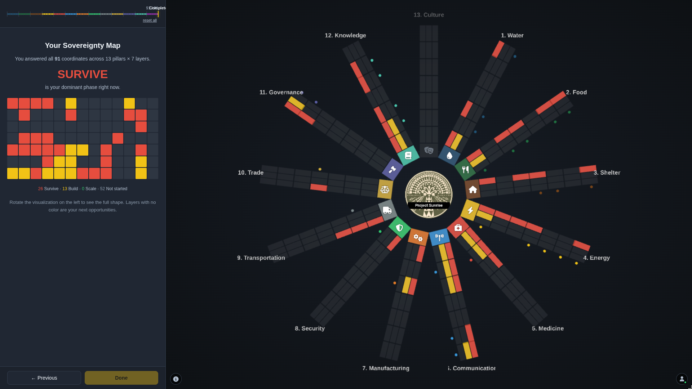

# Sovereignty Hub UI

A user interface for the [Sovereignty Hub System](https://github.com/overkillkulture/sovereignty-hub) developed by OverkillKulture.



## Stack

- **Vite** — dev server + build
- **Three.js** — 13-pillar survey visualization
- **@supabase/supabase-js** — magic-link auth + per-user state sync
- **Font Awesome** (via CDN in `index.html`) — pillar icons

## Run

```bash
npm install
npm run dev      # http://localhost:5173
npm run build    # → dist/
```

## Environment

Copy `.env.sample` to `.env` and fill the Supabase keys. Vite exposes any `VITE_*` env var to the client at build time.

## Layout

```
hub-ui/
├── index.html                # entry document
├── src/
│   ├── main.js               # bootstrap + everything wired together
│   ├── style.css             # all styles
│   └── lib/
│       ├── supabase.js       # Supabase client
│       ├── auth.js           # magic-link auth state
│       ├── db.js             # profile + survey_state sync
│       └── survey-content/   # per-pillar question + phase copy
├── supabase/
│   └── schema.sql            # tables, RLS, trigger, storage bucket
└── vite.config.js
```

## Roadmap

- [x] Phase 0 — Vite scaffold + monolithic file split
- [x] Phase 1 — Supabase auth (magic link)
- [x] Phase 2 — Per-user survey + hub state sync to Supabase
- [ ] Phase 3 — Globe view (graph ↔ globe toggle)
- [ ] Phase 4 — Multi-hub discovery on the globe
